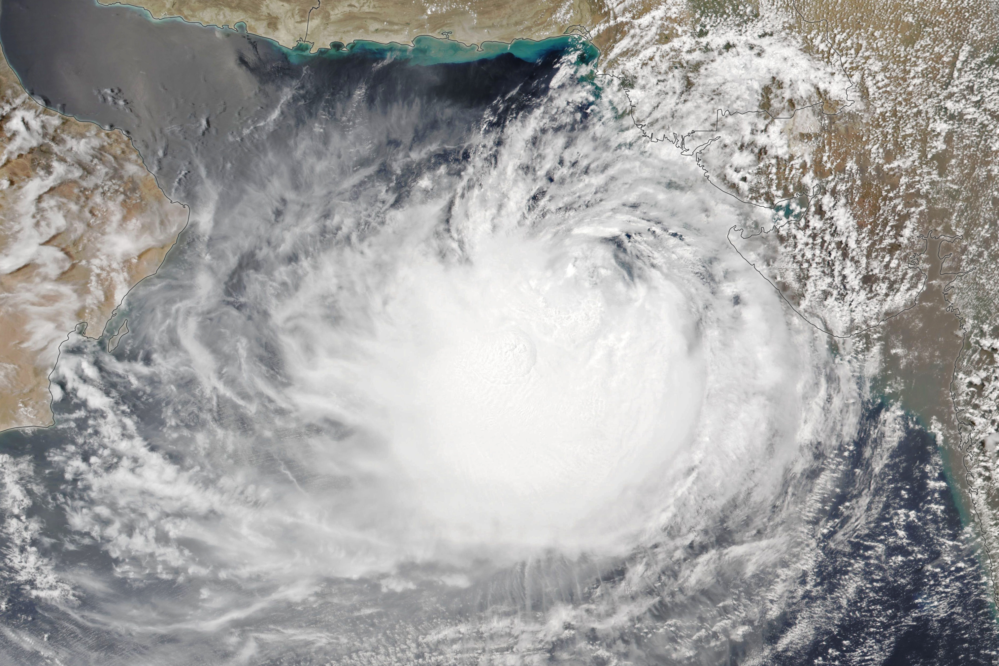

📘 README for ThaparSat – First Student-Designed Satellite from TIET

Overview

ThaparSat is a nano-satellite project developed by a dedicated team of 25 students and 6 faculty members at Thapar Institute of Engineering & Technology, Patiala, 
under the guidance of Prof. Mamata Gulati. 
The initiative was launched in 2020 to provide hands-on experience in satellite design, development, testing, and mission planning.

Objectives & Mission

1. Monitor Greenhouse Gases: Measure real-time levels of CO₂, CH₄, and N₂O across Northern India.
2. Measure Soil Moisture: Provide data on soil moisture to support agricultural decision-making in Punjab and surrounding regions.

- - - - - - - - - - - - - - - - - - - - - - - - - - - - - - - - - - - - - - - - - - - - - - - - - - - - - - - - - - - - - - - - - - - - - - - - - - - - - - - - - - - - - - - - - - 

🌪️ Cyclone Prediction using NOAA Satellite Imagery

Role: Remote Sensing Intern at ThaparSat | Duration: June 2023 – February 2024

As part of the ThaparSat student satellite mission, I contributed to a sub-project focused on cyclone intensity prediction using satellite imagery 
and remote sensing techniques. The goal was to develop a dataset and model capable of estimating the strength of cyclones in the Indian Ocean region 
using data from the NOAA satellite.

📥 Dataset Collection & Preparation

Collected satellite imagery from NOAA-18 and GOES platforms covering active cyclones between June 2023 and February 2024.
Images included infrared and visible spectrum bands, especially channel 4 (IR longwave) for nighttime storms.
Focused on the Bay of Bengal and Arabian Sea regions to capture tropical cyclone activity during monsoon and post-monsoon seasons.
Sample image snippets from our dataset are included in this repository.

🛰️ Data Source & Imagery

Satellite: NOAA18
Region of Interest: Arabian Sea
Timeframe: June 2023
Image Types Used:
Thermal Infrared (10.3–11.3 µm) → Cold cloud-top analysis
False Color Composite → Structural visualization of spiral bands
Visible Imagery → Eye clarity and symmetry (daytime only)

📌 Sample IR image of Cyclone Biparjoy is included in this repository.

### 🗂️ Sample Cyclone Data

| Date       | Cyclone Name   | Image Type         | Estimated T-Value |
|------------|----------------|--------------------|-------------------|
| 2023-06-13 | Biparjoy       | Thermal IR (Band 4)| T4.5              |

---

### 📷 Cyclone Biparjoy – Thermal Infrared Imagery  
  
*Satellite image showing cold cloud tops and central dense overcast of Cyclone Biparjoy (June 2023)*

🛰️ NOAA-18 Satellite Imagery Samples (April 19, 2023)
The following images demonstrate different types of satellite imagery used during the early stages of the cyclone season. These were processed as part of the cyclone prediction model using NOAA-18 data.

<table> <tr> <td align="center"> <b>🌈 False Color Elevation</b>    Highlights surface elevation using vegetation and water reflectance patterns. </td> <td align="center"> <b>🌍 False Color Composite</b>    Useful for distinguishing between clouds, land cover, and water bodies. </td> <td align="center"> <b>🌡️ Thermal Infrared</b>    Captures outgoing longwave radiation to assess cloud-top temperatures. </td> </tr> </table>

🌪️ Dvorak’s Technique for Cyclone Intensity Estimation

Dvorak’s Technique is a widely-used satellite-based method to estimate the intensity of tropical cyclones. Developed by Vernon Dvorak in the 1970s, it involves visually interpreting satellite imagery and matching observed cloud patterns with predefined templates to assign a T-number (Tropical Number), which corresponds to the storm's strength.

🧠 Core Idea:

The method links specific visual patterns and temperature characteristics—such as the shape, symmetry, and coldness of cloud tops—with cyclone intensity. This makes it especially valuable in cases where in-situ data (like aircraft reconnaissance) is unavailable.

🔍 What is the Dvorak Technique?

The Dvorak Technique is a satellite-based method for estimating the intensity of tropical cyclones. It correlates visible/infrared cloud features with 1-minute sustained wind speeds, converting them to T-numbers that reflect cyclone intensity.

Here is the reference table we used:

### 🌀 Dvorak Cyclone Intensity Classification Table

| T/CI Number | Classification of CDs   | Wind Speed (Knots) | Wind Speed (km/h) | Pressure (P) | Wind Criteria (Knots) | Wind Criteria (km/h) |
|-------------|--------------------------|---------------------|--------------------|--------------|------------------------|-----------------------|
| T1.0        | L                        | –                   | –                  | –            | ≤ 17                   | ≤ 31                  |
| T1.5        | D                        | 25                  | 46.3               | –            | 17–27                  | 31–49                 |
| T2.0        | DD                       | 30                  | 55.6               | 4.5          | 28–33                  | 50–61                 |
| T2.5        | CS                       | 35                  | 64.9               | 6.1          | 34–47                  | 62–88                 |
| T3.0        | –                        | 45                  | 83.4               | 10.0         | –                      | –                     |
| T3.5        | SCS                      | 55                  | 101.9              | 15.0         | 48–63                  | 89–117                |
| T4.0        | VSCS                     | 65                  | 120.5              | 20.9         | 64–89                  | 118–166               |
| T4.5        | –                        | 77                  | 142.7              | 24.4         | –                      | –                     |
| T5.0        | ESCS                     | 90                  | 166.8              | 40.2         | 90–119                 | 167–221               |
| T5.5        | –                        | 102                 | 189.0              | 51.6         | –                      | –                     |
| T6.0        | –                        | 115                 | 213.1              | 65.6         | –                      | –                     |
| T6.5        | SuCS                     | 127                 | 235.4              | 80.0         | ≥ 120                  | ≥ 222                 |

**Legend**:
- **L**: Low Pressure  
- **D**: Depression  
- **DD**: Deep Depression  
- **CS**: Cyclonic Storm  
- **SCS**: Severe Cyclonic Storm  
- **VSCS**: Very Severe Cyclonic Storm  
- **ESCS**: Extremely Severe Cyclonic Storm  
- **SuCS**: Super Cyclonic Storm

📊 Wind Data Analysis Workflow

Dataset:
NASA POWER CSV export (example: Jan-Feb - POWER_Regional_Daily_20240101_20240229.csv)
Parameters Used:
Daily average wind speed
Daily max wind speed
Surface pressure
Conversion:
Wind speed values converted from m/s to knots using:

knots = m/s × 1.94384

T-Value Assignment:
Based on the average or maximum wind speed of a day, we mapped the value to the corresponding Dvorak T-number using the above table.
Labeling:
The satellite image for that day was manually labeled with its T-value to be used in future training datasets or analysis.

Image Labeling:
   - 80 satellite images were labeled with corresponding **T-values** based on max daily wind speed.
   - Labels were stored in a combined dataset (`merged_csv`).

Deployment:  
   The labeled dataset was uploaded and deployed using [LandingAI](https://landing.ai/) to build a model capable of predicting T-values from satellite images.

### 📁 Files

- 'jan-feb.csv' - Wind speed data for months Jan-Feb 2023
- 'july.csv' - Wind speed data for month July 2023
- 'sept-oct.csv' - Wind speed data for months Sept and Oct 2023
- 'nov-dec.csv' - Wind speed data for months Nov and Dec 2023
- `merged_csv.csv` – Final labeled dataset with T-values
  
